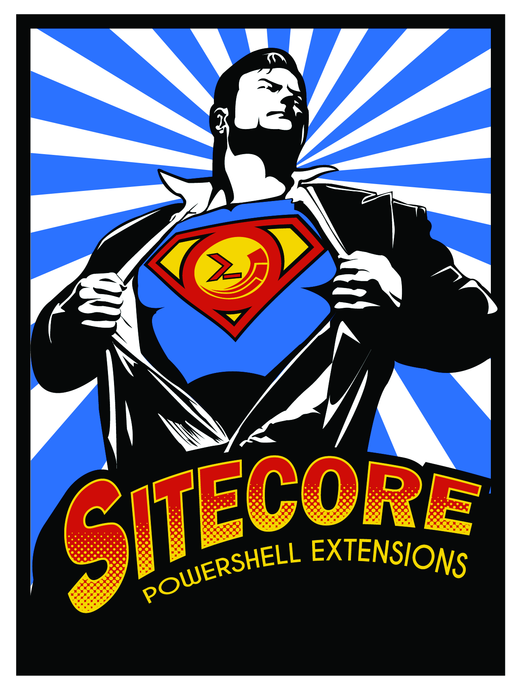

Sitecore PowerShell Extensions
=======

The Sitecore PowerShell Extensions (SPE) module is one of the best ways to manage and extend Sitecore. The module includes a command line interface (CLI) and and integrated scripting environment (ISE) to help automate and aggregate a variety of tasks.

We've maintained a fairly comprehensive list of links to [blogs and videos](http://blog.najmanowicz.com/sitecore-powershell-console/) to help you learn all there is to know about SPE. We hope you find this book helpful.

Development Team:

* [Adam Najmanowicz](http://blog.najmanowicz.com/)
* [Michael West](http://michaellwest.blogspot.com/)
* [Mike Reynolds](http://sitecorejunkie.com/)