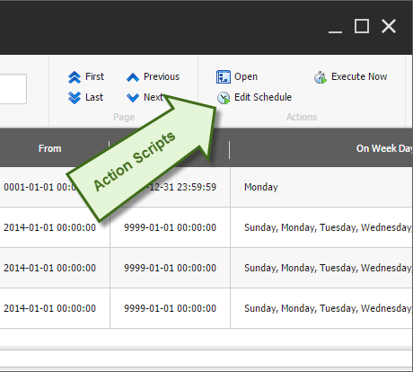
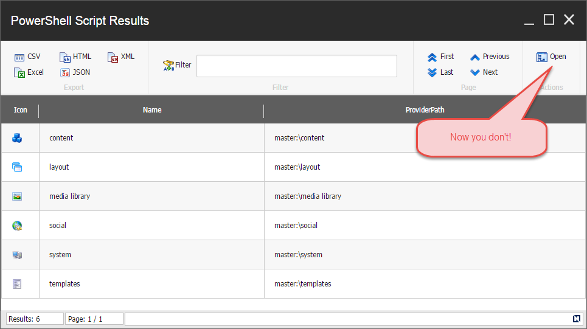

# Authoring Reports

Building reports is a straightforward task. We've provided a variety of examples for you to model when designing your own. 

### Dynamic Reports

The **Authorable Reports** module includes reports such as *Index Viewer* and *Rules based report* that provide input dialogs to help make the reports dynamic. 

#### Index Viewer
The *Index Viewer* report provides a great example at how to build a generic report that queries against the Sitecore index. By navigating to *Sitecore -> Toolbox -> Index Viewer* you can conveniently launch the report.

First you will be prompted with a dialog to select the index to search.


Next you will be prompted with a variety of buttons and knobs to narrow down the search results.


Finally the report is shown. Each row has an option to show more field results.


The *Show Full Info* link will then returns the additional fields not shown in the report.


The **Authorable Reports** module has a few points of interest.

* The script library *Internal/List View/Ribbon/SearchResultItem* instructs the report to show the action scripts when the row contains an entry with the typename *SearchResultItem*.
* The script library *Toolbox/Index Viewer* represents the shortcut.


**Examples:**
* [Creating Beautiful Sitecore Reports Easily with PowerShell Extensions][6]

### Static Reports

The **Content Reports** module includes other reports used for auditing. Below are some examples on how to create your own.

**Examples:**
 * [Images with an empty alt field][1]
 * [Unused media items][2]

### Report Actions

Content extracted from [Turn Your Sitecore Powershell Reports into Applications with Action Scripts][3] article written by Adam.

Actions are simply commands powered by scripts and with visibility dependent on certain conditions like the .Net class of the object that is displayed or perhaps other session settings.



You define an action as a script located in an SPE script library and appears in the Actions panel. In the simplest scenario the action would appear when the script library name matches the .Net class name of the items displayed. In the above scenario the actions are placed under `/Platform/Internal/List View/Ribbon/Item/` where *Platform* is the module and *Item* is a script library. Let's take a look at the script here `/Platform/Internal/List View/Ribbon/Item/Open`

```powershell
foreach($item in $selectedData){
# Run Sheer application on Desktop
Show-Application `
    -Application "Content Editor" `
    -Parameter @{id ="$($item.ID)"; fo="$($item.ID)"; 
                 la="$($item.Language.Name)"; vs="$($item.Version.Number)";
                 sc_content="$($item.Database.Name)"}
}
```

The variable `$selectedData` is provided to the script automatically by SPE in context of the content of the results on `Show-ListView`.

##### What input is passed to an action script?

When your action script is executed the environment is initialized with a number of variables at your disposal as seen below:

* `$selectedData` – the selected objects in the list view (the same will be passed to the `$resultSet` variable for compatibility with older scripts)
* `$allData` – all objects passed to the list view using the `-Data` parameter.
* `$filteredData` – all objects displayed after filtering is performed with the search criteria entered by the user in the ribbon.
* `$exportData` – same as `$filteredData`, however in this case the objects will have additional properties to support easy display with properties processed as text.
* `$actionData` – any object that was passed to `Show-ListView` using the `-ActionData` parameter. Useful when you need additional context that the `Show-ListView` command does not explicitly know about. It’s your custom data.
* `$formatProperty` – the content of the `–Property` parameter when running the command.
* `$title` – window title of the list view.
* `$infoTitle` – info title of the list view.
* `$infoDescription` – info title of the list view.

Consequently you get the full state of the report the user sees in the UI and you can act upon it.

##### How the report determines if your action is visible?
You can have multiple actions defined with dynamic visibility. The actions are generally only relevant in the context of your report. This is done on two levels. The first level happens based on the location of the script and .Net object type you are displaying in the report. The second level is based on Sitecore rules. For the action to appear all of the following conditions must be met:

* All scripts visible in the report should be located in an enabled module.
* The action script should be within the path `/Internal/List View/Ribbon/[Object type]`. The `[Object type]` is the name of the .Net class for which the action is valid. For example, if you want your action to be visible for `Sitecore.Data.Items.Item` then save the script at the path `/Internal/List View/Ribbon/Item`.
* If the action script has no rules defined in the "Show if rules are met or not defined" field it will appear for all objects passed to `Show-ListView` that are of the type based on location. Rules will provide more granular control and allow for rule-based conditions that determine action visibility.

##### Using rules to control action visibility

Rules add the full power of the Sitecore rules engine – similarly to what you can do on context menu items or ribbon actions in Content Editor. Some examples where this can be useful include only enabling or disabling the action for items located under a specific branch of the tree or if a [persistent session][7] exists.

The following screenshot shows how to create an action that only appears in reports that list objects of type `Item` that are of template `Schedule`.


For specific reports this global state might not always be enough. You can narrow down the rules further by using the report name. Name your report by providing an additional parameter to  `Show-ListView`.

Consider the following script:
```powershell
Get-ChildItem master:\ | Show-ListView -ViewName ListChildren
```
The output of the report will be like any other unnamed report but adds support for additional rules. Let's say I want my action to open a new report that lists all the children of the selected items in the report "ListChildren". After running the action my script should display the new report with the children and close the "ListChildren" report. Not very useful but illustrates the point.


Now I need to save my script in the proper Script Library in my enabled module:


At this point my action will show on all reports what list Item objects. But now that my script is saved I can modify its rules to narrow it down only to Show for reports named "ListChildren". For this I can click the **Runtime** button in the ISE ribbon and edit the *Show if rules are met or not defined* field.


Now you can specify that you want the action to only appear when the report is named "ListChildren".


Confirm the save on all dialogs to persist your changes. Now our action appears when we run this script in ISE.

```powershell
Get-ChildItem master:\ | Show-ListView -ViewName ListChildren -Property Name, ProviderPath
```


The action does not appear if no view name is provided to the `-ViewName` parameter. Running the script below will produce a report with the action not shown:

```powershell
Get-ChildItem master:\ | Show-ListView -Property Name, ProviderPath
```



##### Updating report in place

The above action works just fine but will close the previous report and open a new report window in the Sitecore desktop. That's not a great user experience. What if you want to update the content of the report in place using the action? That's possible using the `Update-ListView` command. Consider the following script:


In this case we're not closing the existing report but rather updating the list in place, all you need to do is send the new data to the `Update-ListView` command.

##### Showing user progress for long running scripts

One last thing that you might wonder is if the Write-Progress command works as it does in case of ISE or the dialog that runs scripts from Content Editor context menu. Let’s copy the following script into your action:

```powershell
for($i = 0; $i -le 10; $i++){
  Write-Progress -Activity "I need to do something important for 5 seconds" `
    -Status "I'm quite on track..." `
    -PercentComplete ($i*10) -SecondsRemaining (5-$i/2) `
    -CurrentOperation "Trying to look busy.";
  Start-Sleep -m 500
}
 
Write-Progress -Activity "Now I'm doing something else..." `
    -Status "Should take me about 3 seconds but I'm not quite sure...";
Start-Sleep -s 3;
 
for($i = 0; $i -le 10; $i++){
  Write-Progress -Activity "Ok let me revisit one more thing..." `
    -Status "Just 5 more seconds" `
    -PercentComplete ($i*10) -SecondsRemaining (5-$i/2) `
    -CurrentOperation "Just making sure.";
  Start-Sleep -m 500;
}
 
Write-Progress -Completed -Activity "Done."
```

And you will see the following output:


##### Showing other PowerShell dialogs

The action runs fully asynchronously so you’re free to show any of the power of the provided commands. This means that you can ask for additional input using the `Read-Variable` command or Show alert using the `Show-Alert` command or do just about anything possible otherwise from the context menu, ribbon or other interactive integration points.

##### Passing additional data to actions

The `Show-ListView` command has one more useful parameter named `-ActionData` which I mentioned above but is worth mentioning again. Anything passed using this parameter will be set as the `$actionData` variable – this means your report and actions can pass custom data in them it can be as simple as an object or as complex as a hashtable so there is really no hard limit on what can progress from a report to report. Any object that was passed to `Show-ListView` using the `-ActionData` parameter will be available to your action.

##### Actions running in persistent sessions

The persistent session ID will be respected and your script will run in that persistent session if it's already in memory or create a persistent session if it's not.

Alternatively you can elect to simply freeze the session the initial script that generated report was running in and run actions in that same frozen session by using the `-ActionsInSession` parameter.

#### UI Elements

The `Show-ListView` command provides the *Hide* parameter to control visibility of the UI elements.

Add parameter `-Hide` with one or more of the following options:
* `AllExport` - hides all export scripts (left-most ribbon panel)
* `NonSpecificExport` - hides export filters that are not specific to this view as specified by `-ViewName` (left-most ribbon panel)
* `Filter` - hides filter panel
* `PagingWhenNotNeeded` - hides paging when list is shorter than the page specified
* `AllActions` - hides all actions (right-most ribbon panel)
* `NonSpecificActions` - hides actions that are not specific to this view as specified by `-ViewName`  (right-most ribbon panel)
* `StatusBar` - hides status bar.

**Example:** The following example all of the UI elements in the report.
```powershell
Get-ChildItem master:\ | 
    Show-ListView `
        -Hide AllActions, AllExport, Filter, PagingWhenNotNeeded, StatusBar `
        -Property Name, DisplayName, ProviderPath, __Updated, "__Updated By"
```


### Examples from the community!

[Active Commerce][5] for Sitecore product has published reports on Github that you can checkout [here][4].
 


[1]: http://sitecorejunkie.com/2014/05/28/create-a-custom-report-in-sitecore-powershell-extensions
[2]: http://michaellwest.blogspot.com/2014/04/reports-with-sitecore-powershell.html
[3]: http://blog.najmanowicz.com/2015/05/05/turn-your-sitecore-powershell-reports-into-applications-with-action-scripts/
[4]: https://github.com/ActiveCommerce/activecommerce-powershell-extensions
[5]: http://www.activecommerce.com/
[6]: http://blog.najmanowicz.com/2014/10/25/creating-beautiful-sitecore-reports-easily-with-powershell-extensions/
[7]: http://blog.najmanowicz.com/2014/10/26/sitecore-powershell-extensions-persistent-sessions/
