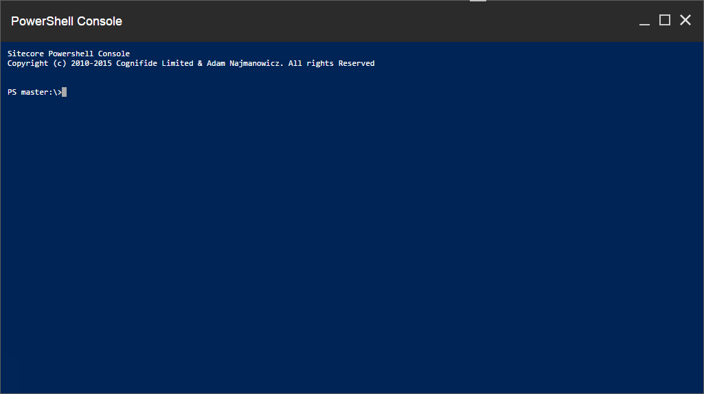

# Console

The SPE Console is a command line interface (CLI) designed for efficiency. The console provides a streamlined tool for working within Windows PowersShell and Sitecore.

Here's a quick look at the Console:


Something to note about the console:
* You can interact with the providers available in the standard Windows PowerShell Console. Below are some of the important providers.Run the command *Get-PSProvider* to see the complete list.
 * FileSystem - Supports interacting with files and folders.
 * CmsItemProvider - Supports interacting with the Sitecore content items.
* The console prompt typically begins with *PS master:\\>*. The present working directory is using the *CmsItemProvider* and set to the *master* database. 
 
 **Example:** Change directories between providers.
 ```powershell
 PS master:\> cd core:
 PS core:\> cd C:
 PS C:\> Set-Location -Path master:
 ```
 **Note:** The command *cd* is an alias for *Set-Location*.
 
* The SPE module provides some convenient variables out of the box for use in running commands and scripts. The variables prefixed with *Sitecore* are extract from the Web.config settings. Run the command *Get-Variable* to see the complete list.
 * AppPath - The website directory.
 * Me - Current logged in user for Sitecore.
 * PWD - Present working directory for the console.
 * SitecoreDataFolder - The data directory.
 * SitecoreDebugFolder
 * SitecoreIndexFolder
 * SitecoreLayoutFolder
 * SitecoreLogFolder
 * SitecoreMediaFolder
 * SitecorePackageFolder
 * SitecoreSerializationFolder
 * SitecoreTempFolder

 **Note:** Any new variables created are stored within the session of console instance; when the session ends the variables are removed.