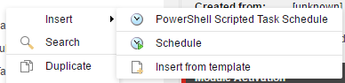
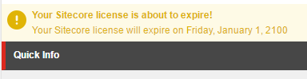

# Content Editor

### Context Menu

The *Context Menu* integration allows for options in the context menu. Rules can be used to control visiblity and enablement. The script is only executed when the option is clicked.

1. Begin by adding a new script to the *Context Menu* library. The name of the script will appear in the context menu.
2. Edit the script to perform the appropriate actions. The script can run in the background and show dialogs.
3. Change the icon of the item to match the script purpose.
4. Configure any rules as needed.

**Note:** Examples included in the following modules
* Authoring Instrumentation
* Copy Renderings
* Index On Demand
* Media Library Maintenance
* Package Generator
 
 
* Task Management

See how Adam added [context menu PowerShell scripts][2].

### Gutter

The *Gutter* integration allows for full flexibility of adding a gutter element.

1. Begin by adding a new script to the *Gutters* library.
2. Edit the script to create a new instance of `Sitecore.Shell.Applications.ContentEditor.Gutters.GutterIconDescriptor` if the right conditions are met. 
  * Set the **Icon**, **Tooltip**, and **Click** properties.
  * Return the gutter object
3. Rebuild the gutter integration from within the ISE.
  * Settings tab
  * Integration chunk
  * Sync Library with Content Editor Gutter command

**Note:** Examples included in the following modules
* Publishing Status Gutter

 

### Insert Item

The *Insert Item* integration allows for insert options in the context menu. Rules can be used to control visiblity and enablement. The script is only executed when the option is clicked.

1. Begin by adding a new script to the *Insert Item* library. The name of the script will appear in the context menu.
2. Edit the script to perform the appropriate actions. The script can run in the background and show dialogs.
3. Change the icon of the item to match the script purpose.
4. Configure any rules as needed.

**Note:** Examples included in the following modules
* Task Management

  
* Platform

### Ribbon

The *Ribbon* integration allows for commands in the ribbon. Rules can be used to control visiblity and enablement. The script is only executed when the option is clicked.

1. Begin by adding a new script library to the *Ribbon* library. The name of the script library will appear in the ribbon as the chunk.
2. Add a new script to the chunk script library. The name of the script will appear in the ribbon chunk as a command.
4. Edit the script to perform the appropriate actions. The script can run in the background and show dialogs.
4. Change the icon of the item to match the script purpose.
5. Configure any rules as needed.

See the birth of [extending the Sitecore ribbon with powershell scripts][1] by Adam.

Check out an example of the [5 steps to extending the Sitecore ribbon][3] in the wild by Toby.

### Warning

The *Warning* integration allows for notifications and commands in the Content Editor. Rules can be used to control visiblity and enablement. The scripts are only executed when the rule is met and the command is clicked.

1. Begin by adding a new script library to the *Warning* library.
2. Edit the script to perform the appropriate actions. The script can run in the background and show dialogs.
3. The warning notification title, text and icon should be configured in the script.
 - Include options to the warning by adding one or more secondary scripts to the script library. 
4. Configure any rules as needed.

**Note:** Examples included in the following modules
* License Expiration - disabled by default

Alan provided a nice example [here][4] on setting up the warning with commands.

[1]: http://blog.najmanowicz.com/2011/11/24/extending-sitecore-ribbon-with-powershell-scripts/
[2]: http://blog.najmanowicz.com/2011/11/22/context-powershell-scripts-for-sitecore/
[3]: https://sitecoresandbox.com/2016/06/03/content-editor-ribbon-buttons-using-sitecore-powershell-extensions/
[4]: https://alan-null.github.io/2016/04/content-editor-notifications