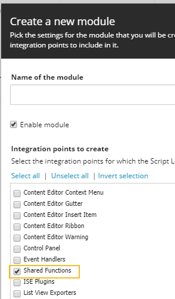
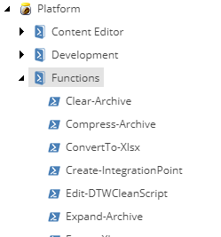

# Functions

The *Functions* integration allows for scripts to be discoverable through autocomplete while authoring scripts. Functions can be "disabled" by disabling the containing module.

1. Begin by adding a script library called "Functions" to a module. This can be created by the new module wizard.
2. Add a script to the "Functions" script library with a name that represents the purpose.
3. Use the command `Import-Function` to discover the available functions.

**Note:** It's best practice to create function scripts that follow the `Verb-Noun` pattern as outlined by Microsoft.

Here's a short video on authoring custom functions.

