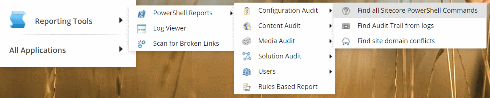
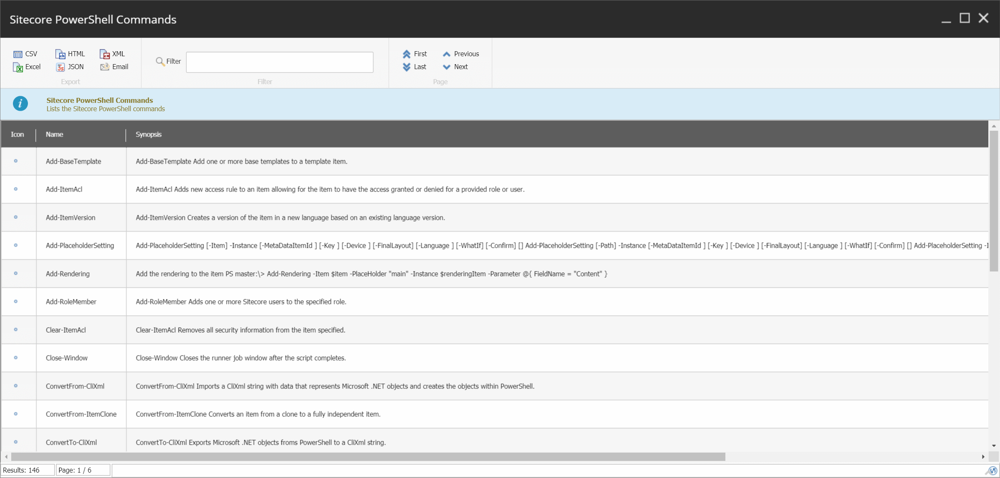
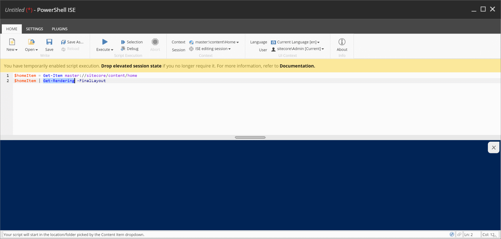
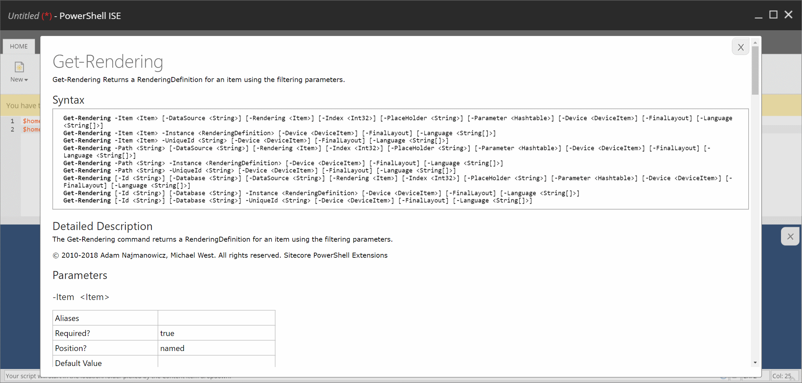

# Help

There are multiple methods of accessing help documentation in SPE to provide you with information on the commands available to you.

## Viewing all available commands

A report is available which will show you all available SPE commands:



When executed, this report provides a paged view of the SPE commands.



## Viewing command help

### Console

To display the available help for a command in the Console, simply use the Get-Help command:

```text
Get-Help Get-Rendering
```

For full documentation, including examples, use the `-Full` parameter:

```text
Get-Help Get-Rendering -Full
```

### ISE

Through the Integrated Scripting Environment \(ISE\), SPE provides a method of acccessing help for available commands. To view the help for a command, simply highlight the command and press Ctrl + Enter.



After doing this, a dialog will appear with the relevant help information:



## Documenting functions

When writing scripts, you are able to include formatted comments that will be used to provide help text for functions. If formatted correctly, this help text will be available through the methods described above.

**Example:** A simple function with documentation:

```text
<#
    .SYNOPSIS 
    A short synopsis of this function.
    .DESCRIPTION
    A much more detailed description of this function, which outputs a value.
    .PARAMETER Value
    The value that will be output 
    .EXAMPLE
    PS> Output-Value "My value"
    My value
#>
Function Output-String
{
    param(
        [string]$value
    )

    Write-Host $value
} 
```

Once the script containing this function has been invoked, the help text will be available:

```text
Get-Help Output-String
```

For further information on comment-based help, refer to the (official PowerShell documentation)[https://docs.microsoft.com/en-us/powershell/module/microsoft.powershell.core/about/about_comment_based_help].

## Online appendix

Online help is additionaly available for all SPE commands in this documentation, with detailed explanations of commands and their parameters, along with useful examples. These can be found in the [Command Appendix](../appendix).