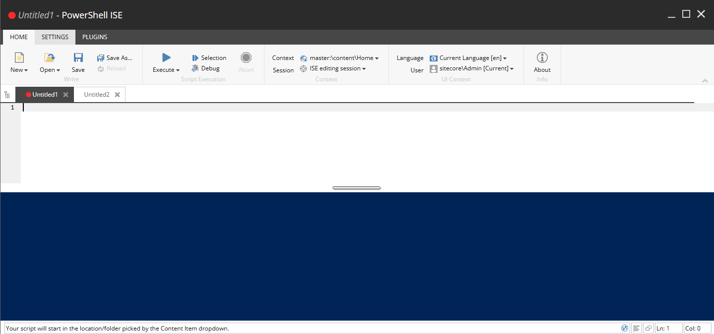

# Scripting

The Integrated Scripting Environment \(ISE\) is a great way to group together commands and save for later use. Think of the ISE as a beefed up version of the Console. The default configuration for SPE requires the ISE to be in an [Elevated Session State](../security/) before executing scripts.

The following figure shows the ISE when the User Account Controls \(UAC\) are disabled. While this is a common configuration for developers, we highly encourage you to ensure UAC is enabled in higher environments.

### Home Tab

* **Write:**
  * New - Creates a new script or module.
  * Open - Opens an existing script for the library.
  * Save - Saves the current script to the library.
  * Save As - Saves a copy of the current script to the library.
  * Reload - Opens the original copy of the current script without saving any modifications.
* **Script Execution:**
  * Execute - Runs the current script as a background job or in the http context.
  * Selection - Runs the selected text of the current script.
  * Debug - Runs the current script with the debugging mode enabled.
  * Abort - Stops the execution of an executing script.
* **Context:**
  * Context - Specifies the current item in the script. Often denoted as a _._ \(dot\) or _$pwd_ \(present working directory\). An MRU and tree view are provided for choosing a path.
  * Session - Specifies the session to use when executing the script. Reused sessions live in the _HttpSession_. Options include the session created for the ISE instance, One-Time session, or the Persistent Session ID configured on the script.
* **UI Context:**
  * Language - Specifies the context language to use when executing the script.
  * User - Specifies the context user to impersonate when executing the script. This can be used to emulate `UserSwitcher` code.

### Settings Tab

* **Preferences:**
  * Settings - This is where you configure the Console and ISE font family, font size, and other useful things.
* **Integration:**
  * Rebuild All - This is where you rebuild the integration points for Control Panel, Gutters, and Ribbons. Without running this you will not see those integrations appear \(or disappear\).

### Plugins Tab

* **Platform:** Custom scripts added to the _ISE Plugins_ integration point script library will appear here.

The _Open_ dialog provides both a search and tree view of the scripts stored in the script libraries.

## Shortcuts

Below are the shortcuts available in the ISE.

| **Shortcut** | **Usage** |
| --- | --- |
| TAB | Indent |
| Ctrl-Space | Autocomplete commands. Use the up or down direction keys to cycle through options. |
| Ctrl-Enter | Displays the command help window. |
| Ctrl-Z | Undo the previous change. |
| Ctrl-Alt-Shift + | Increase the font size |
| Ctrl-Alt-Shift - | Decrease the font size |
| Ctrl-E | Executes the script |
| Alt-E | Executes the selected text in the script |
| Ctrl-D | Debugs the script |
| Ctrl-Shift-E | Aborts the running script |
| Ctrl-F | Search for keywords in the script |

For more commands built into the script editor see \[here\]\[1\]

\[1\]: [https://github.com/ajaxorg/ace/wiki/Default-Keyboard-Shortcuts](https://github.com/ajaxorg/ace/wiki/Default-Keyboard-Shortcuts)

