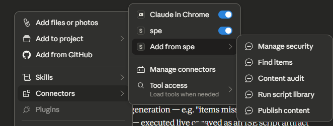
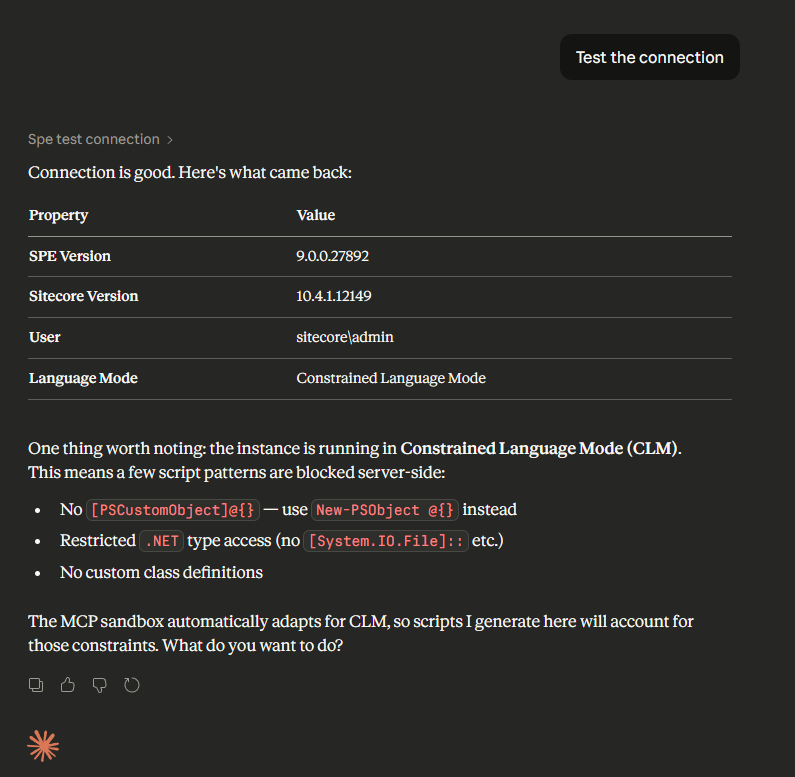

# MCP Server


Introduced in SPE 9.0.


The SPE MCP Server is a [Model Context Protocol](https://modelcontextprotocol.io/) (MCP) server that bridges AI agents to Sitecore PowerShell Extensions. It enables AI assistants like Claude to execute PowerShell scripts on Sitecore instances securely through a standardized protocol.

## Overview

The MCP Server provides:

- **Script execution** — Run PowerShell scripts on Sitecore instances with streaming progress
- **Command discovery** — Browse available SPE commands and get help
- **Workflow management** — Query and advance Sitecore workflows
- **Security sandboxing** — Three modes to control what scripts can do
- **Multi-instance support** — Connect to multiple Sitecore instances from a single server
- **Rate limiting and resilience** — Built-in throttling, retry, and circuit breaker

The server supports two transport protocols:

| Transport | Description | Use Case |
| :--- | :--- | :--- |
| `stdio` | Standard input/output (default) | Claude Desktop, IDE integrations |
| `http` | HTTP server on a configurable port | Web-based clients, shared environments |

## Installation

Install the MCP Server as a .NET global tool:

```bash
dotnet tool install -g SitecorePowerShell.McpServer
```

The server requires .NET 10 or later.


The MCP Server connects to SPE's remoting service. Ensure [remoting is enabled](../security/web-services.md) on your Sitecore instance before proceeding.


## Quickstart

### 1. Configure Claude Desktop

Add the following to your Claude Desktop configuration file (`claude_desktop_config.json`):

```json
{
  "mcpServers": {
    "spe": {
      "command": "spe-mcp-server",
      "env": {
        "SPE_URL": "https://your-sitecore-instance",
        "SPE_SHARED_SECRET": "your-shared-secret",
        "SPE_USERNAME": "sitecore\\mcp-agent"
      }
    }
  }
}
```



### 2. Create a Dedicated Service Account

Create a dedicated Sitecore user for the MCP Server rather than using `sitecore\admin`:

1. Create a user such as `sitecore\mcp-agent`
2. Add the user to the `sitecore\PowerShell Extensions Remoting` role
3. Grant only the permissions the agent needs


**Never use `sitecore\admin` for the MCP Server.** Create a dedicated service account with minimal scoped permissions. See the [Security](security.md) page for detailed guidance.


### 3. Test the Connection

Once configured, ask Claude to test the connection:

> "Test the connection to my Sitecore instance"

Claude will use the `spe_test_connection` tool to verify connectivity and report the Sitecore version, SPE version, and active user.



### 4. Run Your First Script

Ask Claude to run a simple script:

> "List the child items under /sitecore/content"

Claude will use the `spe_execute` tool to run the appropriate PowerShell script and return the results.

## Architecture

The MCP Server acts as a bridge between AI agents and SPE remoting:

```
AI Agent (Claude) <--MCP Protocol--> SPE MCP Server <--HTTP/Remoting--> Sitecore + SPE
```

- **Transport layer** handles MCP protocol communication (stdio or HTTP)
- **Tool layer** maps MCP tool calls to SPE remoting requests
- **Security layer** validates scripts before execution using AST-based analysis
- **Resilience layer** provides retry, circuit breaker, and rate limiting

Both transports share the same service container and tool implementations.

## Configuration

The server is configured via `appsettings.json` or environment variables. Environment variables use the `SPE_` prefix and are resolved automatically.

For a complete configuration reference, see the [Configuration](configuration.md) page.

## Next Steps

- [Tools Reference](tools.md) — All available MCP tools
- [Security & Sandbox](security.md) — Sandbox modes and security configuration
- [Configuration](configuration.md) — Full configuration reference
- [Prompts & Resources](prompts-and-resources.md) — MCP prompts and script library access

## Links

- [MCP Server Repository](https://github.com/SitecorePowerShell/mcp-server)
- [Model Context Protocol Specification](https://modelcontextprotocol.io/)
- [SPE Remoting](../remoting.md)
