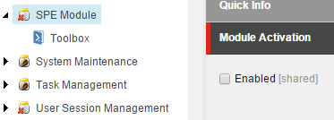

# Modules

Sitecore PowerShell Extensions provides a way to organize your scripts into *modules*. 

Some benefits to using modules:
* The integration points contained within each module can be enabled or disabled globally. For this to take full affect the integration should be rebuilt in the ISE.
* Organization of custom scripts is a cinch.
* More reasons can be found in Adam's [post][1].

**Note:** The *Platform* module is one you should avoid changing.

Getting started with your own module is a short process.

1. Navigate to the *Script Library* item and *Insert -> PowerShell Script Module*.

2. Enter the name for the new module and click *OK*.
3. Right click the new module and *Scripts -> Create libraries for integration points*.  

4. Select the appropriate integration points for your module.  

5. Select the module and enable for use. This is where you would also open the ISE to rebuild integrations.  

[1]: http://blog.najmanowicz.com/2014/11/01/sitecore-powershell-extensions-3-0-modules-proposal/