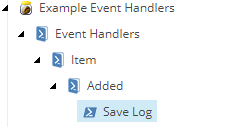

# Event Handlers

The Event Handler integration provides a way to execute scripts when defined events are fired.

Steps required to activate this integration include the following: 1. Enable the _Cognifide.PowerShell.Events.config_ or apply your own patch the required events enabled. 2. Add a new integration point library to your a new or existing module. 3. Add a new script to the appropriate event library. 4. Configure an **Enable Rule** if needed. 5. Profit.

## Enable Configuration

While SPE comes with an example configuration, which is disabled by default, it contains several events that may not meet your requirements.

An event configuration patch may look like the following:

```text
<configuration xmlns:patch="http://www.sitecore.net/xmlconfig/">
  <sitecore>
    <events>
      <event name="item:added">
        <handler type="Cognifide.PowerShell.Integrations.Tasks.ScriptedItemEventHandler, Cognifide.PowerShell" method="OnEvent" />
      </event>
    </events>
  </sitecore>
</configuration>
```

## Add Event Script

To mimic the event _item:added_ you should create nested script libraries such as _Event Handlers -&gt; Item -&gt; Added_ followed by a script.



