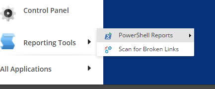

# Reports

The reports which come out of the box provide a wide variety of information regarding your Sitecore installation.

We've built quite a few reports, many similar to the [Advanced System Report](https://github.com/SitecorePowerShell/Book/tree/9c7126d7a38df6ef372e8baef52f9a02baabd550/modules/integration-points/reports/[https:/marketplace.sitecore.net/en/Modules/A/Advanced/_System/_Reporter.aspx]) \(ASR\) module.

## Running a Report

The custom reports can be found by navigating to _Sitecore -&gt; Reporting Tools -&gt; PowerShell Reports_.

As an example, let's run the Unused media items report.

Once the report completes, the results appear in a report window.

## Reports in SPE like ASR

While SPE contains many reports, they don't match identical to ASR reports. We've done our best to build those that seem most relevant or likely to be used. If you find a report in ASR that you would like to exist in SPE please submit a request.

| **SPE Report** | **ASR Report** |
| :--- | :--- |
|  | Active Aliases |
|  | Aliases |
|  | Audit |
| Broken Links2 | Broken Links |
|  | Broken Links in publishable items |
|  | Item History |
|  | Items with Invalid Names |
| Items with security for an account2 | Items with Security for an account |
|  | Items with Tokens in Fields |
|  | Links |
| Locked Items2 | Locked Items |
|  | Logged errors |
| Logged in Session Manager5 | Logged in Users |
| Limit number of versions4 | Multiple versions |
|  | My Owned Items |
| Media items last updated before date3 | Not recently modified |
| Media items not used by content items3 | Orphaned media assets report |
|  | Owned items |
| Recent workflow history2 | Recent Workflow History |
| Media items last updated after date3 | Recently Modified |
|  | Regex Item Searcher |
|  | Renderings |
| Index Viewer5 | - |
| Rules based report5 | - |
| Task Manager report5 | - |

Check the reports in SPE under these sections to see the full list.

* 1 Configuration Audit report
* 2 Content Audit report
* 3 Media Audit report
* 4 Solution Audit report
* 5 Toolbox

**Note:** Examples included are in the following modules

* Content Reports

## Reports Security

You may wish to expose the reports to users such as Content Authors. Here are the steps required to grant access to users in the `sitecore\Sitecore Client Authoring` role.

Here is what users may see in the event they do not have the appropriate access.

1. Navigate to the item `/sitecore/content/Documents and settings/All users/Start menu/Right/Reporting Tools/PowerShell Reports`
2. Grant access to `sitecore\Sitecore Client Authoring`

   

3. Verify the reports are now visible to the Authoring users.

   

**Note:** The role `sitecore\Sitecore Client Maintaining` is granted access to the reports by default.

