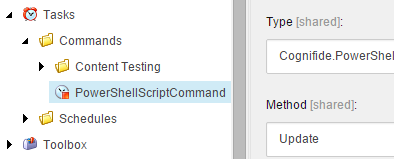
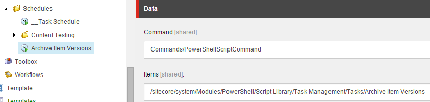
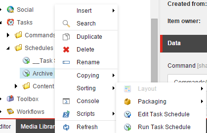

# Tasks

The task scheduler is a great way to run scripts in a periodic fashion. You may find the need to automatically archive log files into a compressed file. Perhaps send an email with a generated report based on stale site content.

## Video Tutorial

[Click for a demo](https://www.youtube.com/watch?v=Q6QKqRwrkuU)

## Scheduled Task Command

To help make the setup simple, we've provided a _Task Command_.

The command shown above is simply a type exposed as a public method in the _Cognifide.PowerShell_ assembly. There exists an update method which accepts one or more items and executes the associated script.

Beneath _Schedules_ you can create as many tasks as Sitecore will allow. Configure the _Command_ and _Items_ fields like that shown below.

The _Items_ field contains the path to a script in the _Script Library_.

Below are some of the scripts found out-of-the-box with SPE.

| Module | Script |
| --- | --- |
| System Maintenance | Archive Sitecore logs, Clean up deleted items older than 30 days |
| User Session Management | Remove idle user sessions |

## Create and Manage Tasks

We've added a context menu item to provide you with a shortcut to the Task Scheduler Editor.

Create a new scheduled task:

Run or edit the scheduled task:

The scheduled task is capable of running 1-to-many scripts. Choose all that apply for the selected task.

**Note:** Make use of the **Enable Rule** to take advantage of the rules engine.

The task schedule has an intuitive dialog for working with and changing the frequency.

**Note:** Examples included are in the following modules

* License Expiration
* Media Library Maintenance
* System Maintenance

See how Adam added [powershell driven Sitecore scheduled tasks](https://github.com/SitecorePowerShell/Book/tree/a1cbd06eba0aad8913e553f4aaa08de0412c635a/modules/integration-points/tasks/[https:/blog.najmanowicz.com/2011/11/29/powershell-driven-sitecore-scheduled-tasks/]/README.md).

