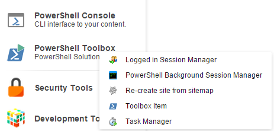

# Toolbox

The PowerShell Toolbox is quick way to access frequently used scripts.

Navigate to _Sitecore -&gt; PowerShell Toolbox_ and after selecting you should see the configured scripts:

**Note:** Examples included in the following modules

* Authorable Reports
* Logged in Session Manager
* Package Generator
* Task Management
* Platform

## Available Tools

### Index Viewer

This tool provides similar functionality to the [Index Viewer](https://marketplace.sitecore.net/en/Modules/I/Index_Viewer.aspx) module. Search and rebuild the index on-demand.

### Logged in Session Manager

View the list of user sessions and "kick" them out as needed.

### Rules based report

Generate a report using the Sitecore Rules Engine.

### PowerShell Background Session Manager

View the list of SPE sessions and "kill" them as needed.

### Create Anti-Package

This tool provides similar functionality to the [Sitecore Rocks](https://github.com/SitecorePowerShell/Book/tree/9c7126d7a38df6ef372e8baef52f9a02baabd550/modules/integration-points/[https:/marketplace.sitecore.net/en/Modules/S/Sitecore/_Rocks.aspx]) module.

### Re-create Site from Sitemap

Simple tool for generating a site tree using an existing sitemap.

### Task Manager

View and manage the configured scheduled tasks.

## Create Tools for the Toolbox

To create your own Toolbox item take the following steps: 1. Create the _Toolbox_ folder under an SPE module. Use the context menu to simplify the process.

* Right click the module name and choose Scripts -&gt; Create libraries for integration points.

  

* Select the _Toolbox_ item and click _Proceed_.

  

  1. Create a _PowerShell Script_ under the _Toolbox_ item.

* Right click the _Toolbox_ library and choose _PowerShell Script_.

  

  1. Open and edit the _PowerShell Script_ using the ISE.

     

  2. Run the _Rebuild All_ command in the ISE by navigating to the _Settings_ tab and selecting the icon to rebuild. Be certain to enable the module before running the rebuild command.

     

  3. Verify the new toolbox item appears in the Toolbox.

     

