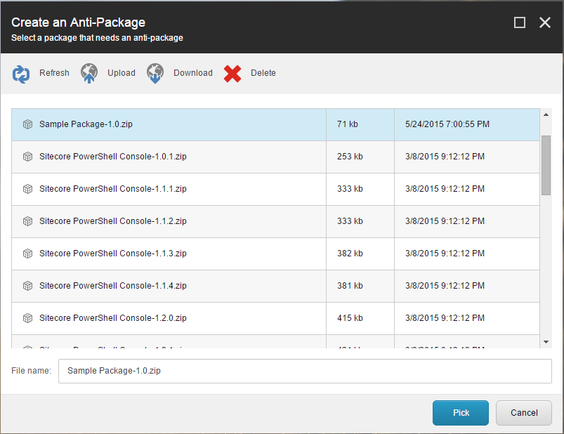
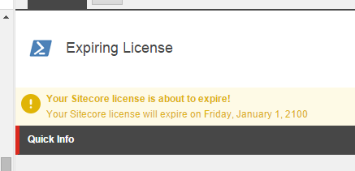
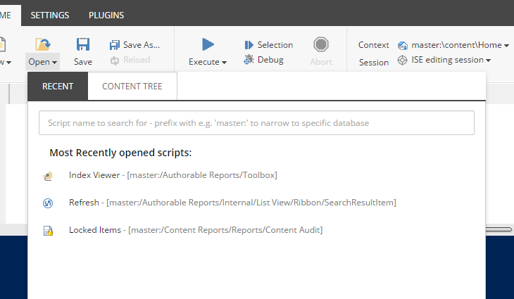
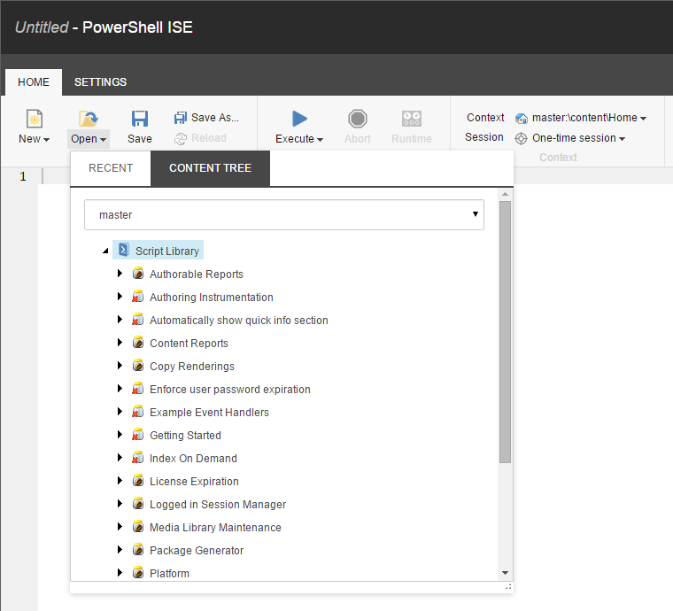

# Releases

## Version 3.1
It's already June and been way too long since we last released SPE. The SPE team has been hard at work preparing for version 3.1 and we hope this version introduces many welcomed changes long overdue. The most important changes are explained below. As always - please provide any and all feedback either on twitter or GitHub.

### New Features

- [337](https://github.com/SitecorePowerShell/Console/issues/337) Create anti-packages
- [293](https://github.com/SitecorePowerShell/Console/issues/293) Rules-based report creator
- [318](https://github.com/SitecorePowerShell/Console/issues/318) **Content Editor** "Insert" menu integration 
- [368](https://github.com/SitecorePowerShell/Console/issues/368) Content Editor warning integration
- [364](https://github.com/SitecorePowerShell/Console/issues/364) Experience Editor notification integration
- [227](https://github.com/SitecorePowerShell/Console/issues/227) New cmdlets for managing Item security allowing for changing which users/roles can do what to which items.
- [341](https://github.com/SitecorePowerShell/Console/issues/341) New-SecuritySource command added to enable inclusion of Users and Roles in packages
- [324](https://github.com/SitecorePowerShell/Console/issues/324) New SPE Remoting module for use outside of Sitecore
- [372](https://github.com/SitecorePowerShell/Console/issues/372) Most Recently Used scripts are now user specific and be stored in master database with user settings.
- [371](https://github.com/SitecorePowerShell/Console/issues/371) Ability to open and save in ISE scripts stored in different database than the current ContentDatabase.

### Enhancements

- [326](https://github.com/SitecorePowerShell/Console/issues/326) `Read-Variable` cmdlet provides the ability to edit Sitecore rules.
- [333](https://github.com/SitecorePowerShell/Console/issues/333) `Write-Log` now defaults to the **DEBUG** log
- [363](https://github.com/SitecorePowerShell/Console/issues/363) Script errors are now logged to the **ERROR** log, which will then show line numbers
- [339](https://github.com/SitecorePowerShell/Console/issues/339) `New-FileSource` and `New-ExplicitFileSource` commands support `InstallMode` for package creation
- [338](https://github.com/SitecorePowerShell/Console/issues/338) `Export-Package` command supports `NoClobber` for package creation
- [336](https://github.com/SitecorePowerShell/Console/issues/336) Event settings moved to a separate include file
- [334](https://github.com/SitecorePowerShell/Console/issues/334) Added System Maintenance Module containing instance optimization scripts
- [350](https://github.com/SitecorePowerShell/Console/issues/350) New version specific dll introduced for compatibility
- [316](https://github.com/SitecorePowerShell/Console/issues/316) Ability to set height of a field in dialog created by `Read-Variable`
- [374](https://github.com/SitecorePowerShell/Console/issues/374) `Show-ModalDialog` can pass parameters through Url handles opening more OOTB Sitecore dialogs for re-use.

### Fixes

- [366](https://github.com/SitecorePowerShell/Console/issues/366) **LoggingIn**, **LoggedIn**, and **LoggedOut** pipelines now use the variable `$pipelineArgs` rather than `$args`
- [357](https://github.com/SitecorePowerShell/Console/issues/357) `Find-Item` command no longer throws *Operation Unsupported* warning
- [358](https://github.com/SitecorePowerShell/Console/issues/358) `Remove-RoleMember` command did not properly remove users from roles.
- [361](https://github.com/SitecorePowerShell/Console/issues/361) `Find-Item` command **Contains** filter indicates properly that case sensitiveness is not Supported by Sitecore if that functionality is used.

### Potential Breaking Changes
- [365](https://github.com/SitecorePowerShell/Console/issues/365) Prescript functionality removed from **ISE**, **Console**, and **Default** settings
- [365](https://github.com/SitecorePowerShell/Console/issues/373) `Core` database no longer can contain scripts

#### Create anti-packages

This is one of those exciting new features, mainly because SPE has had the ability to create packages for a long time, so why not the reverse!? A new library needs to be included in order for the a delete post step to work. It works very much like you find in Sitecore Rocks. If you haven't used that you are missing out on a great tool. 

We started off by adding a new toolbox item.


We enhanced the experience by adding a modal dialog.


#### Rules-based report creator

We had this idea to allow users to generate reports without having to know PowerShell. With this simple toolbox item you can generate a new report in under a minute.

After you launch the toolbox item *Rules based report* you are prompted with a dialog to choose the root node along with the rules.


Choose which custom fields and standard fields you wish to be included in the final report.


#### Content Editor Insert Menu Integration
If you put a script in the `Content Editor/Insert Item/` library in an active module it will automatically get exposed to your users when they select an "Insert" option on an item in content tree in **Content Editor**. Just like with other integrations you can control if and when the script appears by setting appropriate rules on the script item.


#### Content/Experience Editor Message integration

Now it's possible to write a script for generating warnings in the Content Editor and notifications in the Page Editor. We've included a new module in SPE called License Expiration that utilizes the new functionality into something useful. Every module does include a disable feature.




#### Package Users and Roles

The package commands now include a new one called [`New-SecuritySource`](appendix/commands/New-SecuritySource.html) which adds the ability to store Users and Roles in packages created with SPE.

#### ISE Script opening enhancements
Your Most Recently Used scripts are now specific to your account. This means that if your colleagues are using ISE as well you will no longer see their most recently used scripts.



While we were at it, we've also added the tree view for faster access to your scripts. In the second tab in that gallery you can open scripts really quickly. Also if you are already editing a script - your currently edited script will be highlighted so you can switch between scripts in a single module much quicker. 



Not stopping there, we have also added the ability to open scripts from other databases. You can see the database selector drop-down in the above screenshot that gives you ability to open scripts in a different database than your current context database. This gives you ability to edit your scripts in the `master` database while you're working in **Content Editor** in `core` database.

The same database switcher has also been added to the full **Open Script** dialog.

#### SPE module for use outside of Sitecore

We have finally introduced a Windows PowerShell module that can be used outside of Sitecore. The module includes commands to interact with the SPE web services and should be the preferred method.

Either from the downloads section on the Sitecore Marketplace or in Github repo you'll find the package `SPE Remoting-3.1.zip`. 

You'll want to extract the contents to your Windows PowerShell module directory as defined in `$env:PSModulePath` or perhaps even add a new path if necessary.

Since I am using the module under my account I can save it my `$home` path:

`C:\Users\Michael\Documents\WindowsPowerShell\Modules\SPE`

Running `Get-Command` you can get the list of supported commands:

```ps
PS C:\Windows\system32> Get-Command -Module SPE

CommandType Name                ModuleName
----------- ----                ----------
Function    ConvertFrom-CliXml  SPE
Function    ConvertTo-CliXml    SPE
Function    Invoke-RemoteScript SPE
Function    New-ScriptSession   SPE
Function    Receive-MediaItem   SPE
Function    Send-MediaItem      SPE
```

#### Script errors log to the ERROR log

One of the pain points I noticed was that script errors encountered by scripts running outside of the Console and ISE provided insufficient details. Now you can find the error details and with line numbers in the log.

```
4620 19:05:24 ERROR The property 'Icon1' cannot be found on this object. Verify that the property exists and can be set.At line:9 char:1
+ $warning.Icon1 = $icon
+ ~~~~~~~~~~~~~~~~~~~~~
```

#### New config file and libraries introduced

In order to provide better maintenance for SPE we decided to make a few adjustments. Nothing too crazy.

First we split the functionality that was different in Sitecore versions (like the Rules engine) into a separate library called `Cognifide.PowerShell.VersionSpecific.dll`. Doing this allowed us to maintain a single branch of code, where the version specific libraries are compiled with their respective Sitecore versions.

Second we've split the `Cognifide.PowerShell.config` by removing previously unused events section. There are 3 or so events that SPE depends on, so we kept that in the original file. Any of the events you wish to use like `"item:saved"` will now reside in `Cognifide.PowerShell.Events.config.disabled`, if you want to use events simply rename it to `Cognifide.PowerShell.Events.config`.

Third we added a new library called `Cognifide.PowerShell.Package.dll` which enables the deletion of items and files when installing anti-packages. The library does not have any dependencies other than the Sitecore libraries.

### Removed functionality

#### Prescript

We decided that the Prescript functionality was unlikely to be widely used and only introduced confusion when scripts executed. In some situations your prescript would execute, and in others it would never execute. It's gone.

#### Core database scripts

The existence of script libraries in core database was problematic to at least one of our users [375](https://github.com/SitecorePowerShell/Console/issues/375) and we've never really leveraged that capability in the platform either. As a result this functionality has been removed and if you've put any scripts there, you are now asked to kindly move them to either master database or one of the publishing target databases.

###### Happy Scripting!

###### // Michael and Adam

## Version 3.1 (June 2015)
  Release Notes: http://bit.ly/ScPs31Iss
## Version 3.0 (February 2015)
  Release Notes: http://bit.ly/ScPs30Iss
## Version 2.8 (December 2014)
  Release Notes: http://bit.ly/ScPs28Iss
## Version 2.7.5 (November 2014)
  Release Notes: http://bit.ly/ScPs275Iss
## Version 2.7.1 (September 2014)
  Release Notes: http://bit.ly/ScPs271Iss
## Version 2.7 (August 2014)
  Release Notes: http://bit.ly/ScPs27Iss
## Version 2.6 (April 2014)
  Release Notes: http://bit.ly/ScPs26Iss
## Version 2.5 (28 October 2013)
  Release Notes: http://bit.ly/ScPs25Iss
## Version 2.4 (23 September 2013)
  Release Notes: http://bit.ly/ScPs24Iss
## Version 2.3.1 (1 September 2013)
  Release Notes: http://bit.ly/ScPs23Iss
## Version 2.2 (30 July 2013)
  Release Notes: http://bit.ly/ScPs22Iss
## Version 2.1 (15 July 2013)
  Release Notes: http://bit.ly/ScPs21Iss
