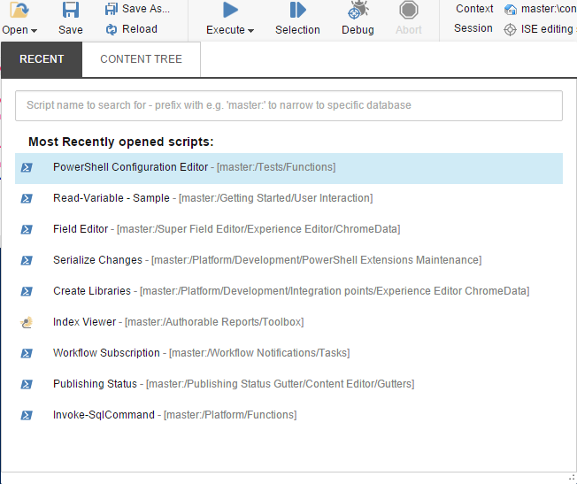

# Scripting

The Integrated Scripting Environment (ISE) is a great way to group together commands and save for later use. Think of the ISE as a beefed up version of the Console.

Let's have a quick look at the ISE:

#### Home Tab
* **Write:**
  * New - Creates a new script or module.
  * Open - Opens an existing script for the library.
  * Save - Saves the current script to the library.
  * Save As - Saves a copy of the current script to the library.
  * Reload - Opens the original copy of the current script without saving any modifications.
* **Script Execution:**
  * Execute - Runs the current script as a background job or in the http context.
  * Selection - Runs the selected text of the current script.
  * Abort - Stops the execution of an executing script.
  * Runtime
* **Context:**
  * Context - Specifies the current item in the script. Often denoted as a *.* (dot) or *$pwd* (present working directory). An MRU and tree view are provided for choosing a path.
  * Session - Specifies the session to use when executing the script. Reused sessions live in the *HttpSession*. Options include the session created for the ISE instance, One-Time session, or the Persistent Session ID configured on the script.

#### Settings Tab
* **Preferences:**
  * Settings - This is where you configure the Console and ISE font family, font size, and other useful things.
* **Integrations:**
  * Rebuild All - This is where you rebuild the integration points for Control Panel, Gutters, and Ribbons. 

#### Plugins Tab
* **Platform:** Custom scripts added to the *ISE Plugins* integration point script library will appear here.

The *Open* dialog provides both a search and tree view of the scripts stored in the script libraries. 

### Shortcuts
Below are the shortcuts available in the console.

| Shortcut  | Usage |
| --------  | ----- |
| TAB       | Indent |
| Ctrl-Space       | Autocomplete commands. Use the up or down direction keys to cycle through options.  |
| Ctrl-Enter | Displays the command help window. |
| Ctrl-Z | Undo the previous change. |
| Ctrl-Alt-Shift +  | Increase the font size |
| Ctrl-Alt-Shift -  | Decrease the font size |
| Ctrl-E | Executes the script |
| Alt-E | Executes the selected text in the script |
| Ctrl-D | Debugs the script |
| Ctrl-Shift-E | Aborts the running script |
| Ctrl-F | Search for keywords in the script |

For more commands built into the script editor see [here][1]

[1]: https://github.com/ajaxorg/ace/wiki/Default-Keyboard-Shortcuts