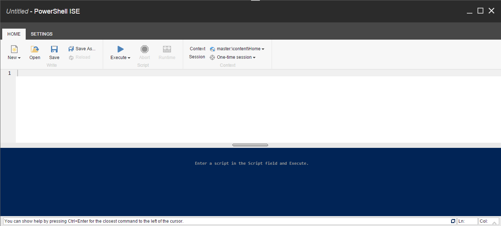

# Scripting

Once you move beyond running a single commands, you will begin to combine those into scripts for automation.
The Integrated Scripting Environment (ISE) is a great way to group together those individual commands. Below is an example of the SPE ISE.

As you can see, the ISE closely resembles the Windows PowerShell ISE version 3 or later.