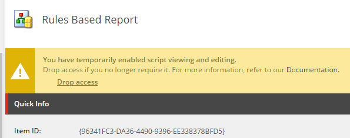
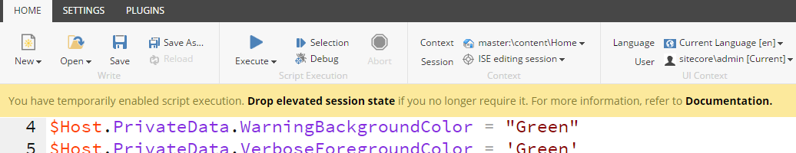

# Security

You need to be mindful that Sitecore PowerShell Extensions is a very sharp tool and while it can be leveraged to do great things, it can also be a vector of dangerous attacks if not secured properly. This is why we recommend that you **do not install** it on Content Delivery instances and if possible avoid deploying it on servers that face Internet altogether.


Installing SPE in internet facing \(DMZ\) scenarios is not recommend. Please avoid installing in the Content Delivery instances. Implement a strategy which provides the least amount of access required. Consider locking down the web server to only allow connections to your databases and preapproved web services.


## Security Policies

There are two main security policies to consider when using the SPE module:

* Application Pool service account
* Sitecore user account

### Application Pool Service Account

The first policy relates to the Application Pool service account running in IIS. The Windows PowerShell runspace will have access to the local system via providers \(i.e. FileSystem, Registry\), and be managed through the Console or ISE. If the service account is capable of removing files from the root directory, then SPE can accomplish the same.

When using the IIS identities such as _ApplicationPoolIdentity_ and _NetworkService_ the scripts may have access to directories outside of the application such as the drive root; you should perform a due dilligence to make sure this is the case! You may also notice that the _$HOME_ variable is empty; this is because only named service accounts have profiles.


The application pool service account can give SPE access to many features in the OS.


### Sitecore User Account

The second policy relates to the Sitecore user account. The code executed through SPE operates within the privileges of the logged in user. Keep in mind that this can be bypassed just as can be done through the Sitecore API as PowerShell scripts can call the APIs that disable the Sitecore security.

**Application Security**  
The following settings are configured under `core:\content\Applications\PowerShell`.

| **Feature** | **Visibility** |
| :--- | :--- |
| PowerShell Console | sitecore\Developer \(read\) |
| PowerShell ISE | sitecore\Developer \(read\) |
| PowerShell ListView | sitecore\Sitecore Client Users \(read\) |
| PowerShell Runner | sitecore\Sitecore Client Users \(read\) |
| PowerShell Reports | sitecore\Sitecore Client Authoring. See [here](../modules/integration-points/reports/) for instructions. |

**Note:** The security is validated in each SPE application within the function `OnLoad`.

**Menu Item Security**  
The following settings are configured under `core:\content\Applications\Content Editor\Context Menues\Default\`.

| **Feature** | **Visibility** | **Command State** |
| :--- | :--- | :--- |
| Edit with ISE | sitecore\Developer \(read\) | **Enabled** when item template is _PowerShell Script_ otherwise **Hidden** |
| Console | sitecore\Developer \(read\) | **Enabled** when user is _admin_ or in the role _sitecore\Sitecore Client Developing_ otherwise **Hidden** |
| Scripts | sitecore\Sitecore Limited Content Editor \(deny read\) | **Enabled** when the service and user are authorized to execute otherwise **Hidden** |

**Note:** See the _Interactive_ section on _PowerShell Script Library_ and _PowerShell Script_ items for visibility and enabled rules. To hide each feature you can change the security settings for the roles that should not see the menu.

## Security Hardening

The following section outlines steps you can take to minimize the surface area for attack. The following topics describe how to manage security for interfaces and services for the various parts of the module.

### Session Elevation

The [interfaces](../interfaces/) bundled with the module provide convenient ways to interact with the Sitecore API. The module provides a **User Account Control** \(UAC\) feature akin to that of Microsoft Windows.

#### User Account Control

Let's have a look at the configurable features which make up the UAC.

**Gate**

The way in which scripts make their way into Sitecore through built-in interfaces. Includes the [Console](../interfaces/console.md), [ISE](../interfaces/scripting.md), and Content Editor via _Item Saving_.

| Attribute | Description |
| :--- | :--- |
| name | built-in name for the gate |
| token | name of the token to use for the elevated session |

**Token**

The object which expires after a predetermined time. These can be unique to each gate or shared.

| Attribute | Description |
| :--- | :--- |
| name | unique string used for the gate _token_ attribute |
| expiration | timespan used to determine the elevated session lifetime \(hh:mm:ss\) |
| elevationAction | action to perform when session elevation is triggered \(allow, block, password\) |

Actions supported out of the box:

* **Allow** - Always allow the session to run elevated without prompting the user for permission. This should never be used outside of a developer's machine.
* **Block** - Always block the session from running elevated without prompting the user for permission.
* **Password** - Prompt the user for a password before running the session elevated, unless an unexpired session is active.
* **Confirm** - Prompt the user for a confirmation before running the session elevated.

**Example:** The following extends the token expiration to 10 minutes and blocks the use of the Console.

```markup
<sitecore>
  <powershell>
    <userAccountControl>
      <tokens>
        <token name="Console">
          <patch:attribute name="expiration">00:10:00</patch:attribute>
          <patch:attribute name="elevationAction">Block</patch:attribute>
        </token>
        <token name="ISE">
          <patch:attribute name="expiration">00:10:00</patch:attribute>
        </token>
        <token name="ItemSave">
          <patch:attribute name="expiration">00:10:00</patch:attribute>
        </token>
      </tokens>
    </userAccountControl>
  </powershell>
</sitecore>
```

Gates with **Password** protection enabled prompt the user when no elevated session is available. When using Azure AD and or similar provider you should use the **Confirm** action.


**Content Editor**

A Content Editor Warning is displayed when a PowerShell Module, Script Library, and Script is selected. Click "Elevate session" to show the hidden fields and enable the management of the item.


The "Drop session" option appears after credentials are verified. All scripts can be edited while the session is elevated.



**ISE**

A warning is presented in the ISE when no elevated session state is available.


The following warning is rendered in the ISE while the session state is elevated. Click "Drop elevated session state" if you do not want to wait for the elevated session to timeout.



### Configure Web Services

The web services providing external access to Sitecore are disabled by default. You can override this behavior by patching the following configuration file `\App_Config\Include\Spe.config`.

Look for the following section and enable as needed.

```markup
<sitecore>
  <powershell>
    <services>
      <restfulv1 enabled="false" />
      <restfulv2 enabled="false" />
      <remoting enabled="false" />
      <fileDownload enabled="false" />
      <fileUpload enabled="false" />
      <mediaDownload enabled="false" />
      <mediaUpload enabled="false" />
      <handleDownload enabled="true" />
      <client enabled="true" />
      <execution enabled="true" />
    </services>
  </powershell>
</sitecore>
```

#### Service Descriptions

* **Remoting** - Used when passing scripts to SPE for execution. Enable when using the **SPE Remoting** module. Service associated with `RemoteAutomation.asmx`.
* **RESTful v2** - Used when the url contains all the information needed to execute a script saved in the SPE library. Service associated with `RemoteScriptCall.ashx`.
  * Required for the following features: PowerShell [Web API](../modules/integration-points/web-api.md).
* **File Download** - Used when the url contains all the information needed to download a file from the server. Enable when using the **SPE Remoting** module. Service associated with `RemoteScriptCall.ashx`.
* **File Upload** - Used when the url contains all the information needed to upload a file to the server. Enable when using the **SPE Remoting** module. Service associated with `RemoteScriptCall.ashx`.
* **Media Download** - Used when the url contains all the information needed to download a media item from the server. Enable when using the **SPE Remoting** module. Service associated with `RemoteScriptCall.ashx`.
* **Media Upload** - Used when the url contains all the information needed to upload a media item to the server. Enable when using the **SPE Remoting** module. Service associated with `RemoteScriptCall.ashx`.
* **Handle Download** - Used when a file is downloaded through the Sitecore interface. Enable when using the **SPE Remoting** module. Service associated with `RemoteScriptCall.ashx`.
  * Required for the following features: [Out-Download](../appendix/common/out-download.md) command. If the report export buttons do not work it could be because of this setting.
* **Client** - Used for the SPE Console. Service associated with `PowerShellWebService.asmx`.
  * Required for the following features: PowerShell [Console](../interfaces/console.md), PowerShell [ISE](../interfaces/scripting.md), 
* **Execution** - Used when SPE checks if the user has access to run the application.
  * Required for the following features: [Download File](../interfaces/interactive-dialogs.md) dialog, PowerShell Script Runner, [Content Editor](../modules/integration-points/content-editor.md) \(Context Menu, Insert Options, Ribbon\). 
* **RESTful v1** - Used in early version of SPE. Avoid using this if possible. Service associated with `RemoteScriptCall.ashx`.

The preferred way to override the settings is through the use of a configuration patch file.

**Example:** The following enables the file and media downloads.

```markup
<configuration xmlns:patch="https://www.sitecore.net/xmlconfig/">
  <sitecore>
    <powershell>
      <services>
        <fileDownload>
          <patch:attribute name="enabled">true</patch:attribute>
        </fileDownload>
        <mediaDownload>
          <patch:attribute name="enabled">true</patch:attribute>
        </mediaDownload>
      </services>
    </powershell>
  </sitecore>
</configuration>
```

**Example:** The following enables the SPE Remoting service and requires a secure connection using HTTPS.

```markup
<configuration xmlns:patch="https://www.sitecore.net/xmlconfig/">
  <sitecore>
    <powershell>
      <services>
        <remoting>
          <patch:attribute name="requireSecureConnection">true</patch:attribute>
          <patch:attribute name="enabled">true</patch:attribute>
        </remoting>
      </services>
    </powershell>
  </sitecore>
</configuration>
```

**Note:** When using the attribute `requireSecureConnection`, you may find that this causes a 403 status code when testing against a server hosted behind a load balancer. If the load balancer maintains the TLS certificate and forwards traffic to a backend web server over port 80 .Net will not recognize this as a secure connection.

### Restrict Users and Roles

#### Sitecore level security

You are required to explicitly grant the SPE Remoting session user account to a predefined role found in the configuration `Spe.config`. There is a generic list of permissions configured by default but we highly encourage you to adjust to meet your security requirements.

**Example:** The following configuration defines the roles that have access to use SPE Remoting. Any role previously defined in the `<authorization/>` section is removed and custom roles are then added.

```markup
<configuration xmlns:patch="https://www.sitecore.net/xmlconfig/">
  <sitecore>
    <powershell>
      <services>
        <remoting>
          <authorization>
            <patch:delete />
          </authorization>
          <authorization>
            <add Permission="Allow" IdentityType="Role" Identity="sitecore\PowerShell Extensions Remoting" />
          </authorization>
        </remoting>
      </services>
    </powershell>
  </sitecore>
</configuration>
```

**Example:** The following configuration grants access to custom roles without removing any existing roles.

```markup
<configuration xmlns:patch="https://www.sitecore.net/xmlconfig/">
  <sitecore>
    <powershell>
      <services>
        <remoting>
          <patch:attribute name="enabled">true</patch:attribute>
          <authorization>
            <add Permission="Allow" IdentityType="User" Identity="sitecore\test1"  desc="test1" />
            <add Permission="Allow" IdentityType="User" Identity="sitecore\test2"  desc="test2" />
          </authorization>
        </remoting>
      </services>
    </powershell>
  </sitecore>
</configuration>
```

### Delegated Access

There may be scenarios in which you need to grant users access to run scripts which require access to be higher the what is currently configured for the user. The various integration points made visible in the Content Editor (Context Menu, Ribbon, Reports) can be configured to run the scripts impersonating a power user. This has the advantage of giving lower privileged users "special" access without having to make members of more privileged roles. In [#1283](https://github.com/SitecorePowerShell/Console/issues/1283) this feature introduced a simple configuration item to apply the "special" access.

* **Step 1:** Create a new delegated access item using the provided insert option.
 
* **Step 2:** Enter the role in which lower privileged users are members.
* **Step 3:** Enter the user account with elevated access. This could be `sitecore\Admin` or any other user your environment has configured. This user will be impersonated during script execution.
* **Step 4:** Select each script/library that should be delegated. Script/library items with a rule checking for delegated access should be included as well as scripts that should be run with the impersonated account.

* **Step 5:** Enable the delegated access item when ready for use.

When scripts are executed you should see them logged to the SPE log where the context user and impersonated user appear.

> 2304 14:02:32 INFO [Gutter] Executing script {CFE81AF6-2468-4E62-8BF2-588B7CC60F80} for Context User sitecore\test as sitecore\Admin.

### IIS level security

Deny access to the web services for unauthenticated users and roles using the `<deny>` element as described [here](https://msdn.microsoft.com/en-us/library/8aeskccd%28v=vs.71%29.aspx) in `sitecore modules\PowerShell\Services\web.config`.

**Example:** The following configuration will deny anonymous calls to the web services.

```markup
<configuration>
    <system.web>
      <authorization>
        <deny users="?" />
      </authorization>
    </system.web>
</configuration>
```

If you disable _Anonymous Authentication_ and enable _Windows Authentication_ in IIS, such as the directory `sitecore modules\PowerShell\Services\` you'll need to use the **Credential** parameter for any command that interacts with the services. See the [Remoting](../remoting.md) section for examples.

### Minimal Web Service Configuration

The following files are the bare minimum required to support SPE web services. This setup is suitable for environments such as servers built within a Continuous Integration environment that need remoting enabled. Remoting is **disabled** by default. If you need this functionality, enable it separately using a config patch file.

**Required:**

* `App_Config\Include\Spe\Spe.config`
* `App_Config\Include\Spe\Spe.Minimal.config`
* `bin\Spe.dll`
* `bin\Spe.Abstractions.dll`
* `sitecore modules\PowerShell\Services\web.config`
* `sitecore modules\PowerShell\Services\RemoteAutomation.asmx`
* `sitecore modules\PowerShell\Services\RemoteScriptCall.ashx`

You will also need to patch the configuration with the following:

```markup
<configuration xmlns:patch="https://www.sitecore.net/xmlconfig/">
    <sitecore>
        <controlSources>
            <source mode="on" namespace="Spe.Client.Controls" assembly="Spe">
                <patch:delete />
            </source>
            <source mode="on" namespace="Spe.Client.Applications"
                  folder="/sitecore modules/Shell/PowerShell/" deep="true">
                <patch:delete />
            </source>
        </controlSources>
    </sitecore>
</configuration>
```

For your convenience we've included a package bundled with all of the above called _SPE.Minimal-6.x.zip_. Any of the disabled configuration files should be enabled following extraction.

### References

* [Shields Down Example](https://alan-null.github.io/2017/01/spe-dev-config)

## Identity Server

**Note:** If you are using Sitecore 9.1 or later with Identity Server, there is a configuration file that should be enabled.

* `Spe.IdentityServer.config`

```markup
<configuration xmlns:patch="http://www.sitecore.net/xmlconfig/" xmlns:role="http://www.sitecore.net/xmlconfig/role/" xmlns:security="http://www.sitecore.net/xmlconfig/security/">
  <sitecore role:require="Standalone or ContentManagement or XMCloud" security:require="Sitecore">
    <pipelines>
      <owin.cookieAuthentication.validateIdentity>
        <processor type="Sitecore.Owin.Authentication.Pipelines.CookieAuthentication.ValidateIdentity.ValidateSiteNeutralPaths, Sitecore.Owin.Authentication">
          <siteNeutralPaths hint="list">
            <!-- This entry corrects the infinite loop of ExecuteCommand in the SPE Console -->
            <path hint="spe">/sitecore%20modules/PowerShell</path>
          </siteNeutralPaths>
        </processor>
      </owin.cookieAuthentication.validateIdentity>
    </pipelines>
  </sitecore>
</configuration>
```
