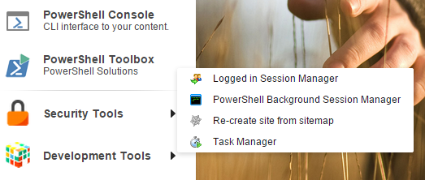

# Toolbox

The PowerShell Toolbox is quick way to access frequently used scripts.

Navigate to Sitecore -> PowerShell Toolbox and after selecting you should see the configured scripts:

To create your own Toolbox item take the following steps:
1. Create the *Toolbox* folder under an SPE module. Use the context menu to simplify the process.
 * Right click the module name and choose Scripts -> Create libraries for integration points.

 * Select the *Toolbox* item and click *Proceed*.

 * Right click the *Toolbox* library and choose *PowerShell Script*.

2. Create a *PowerShell Script* under the *Toolbox* item.

