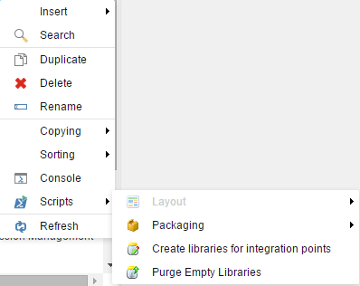
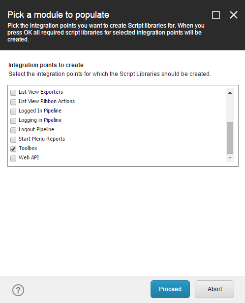
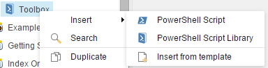
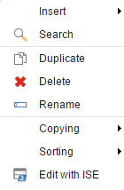
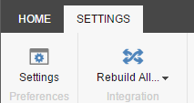

# Toolbox

The PowerShell Toolbox is quick way to access frequently used scripts.

Navigate to Sitecore -> PowerShell Toolbox and after selecting you should see the configured scripts:

#### Available Tools

##### Index Viewer

This tool provides similar functionality to the [Index Viewer][1] module.

##### Logged in Session Manager

View the list of user sessions and "kick" them out as needed.

##### Rules based report

Generate a report using the Sitecore Rules Engine.

##### PowerShell Background Session Manager

View the list of SPE sessions and "kill" them as needed.

##### Create Anti-Package

This tool provides similar functionality to the [Sitecore Rocks][2] module.

#### Create Tools for the Toolbox

To create your own Toolbox item take the following steps:
1. Create the *Toolbox* folder under an SPE module. Use the context menu to simplify the process.
 * Right click the module name and choose Scripts -> Create libraries for integration points.

 * Select the *Toolbox* item and click *Proceed*.  

2. Create a *PowerShell Script* under the *Toolbox* item.
 * Right click the *Toolbox* library and choose *PowerShell Script*.  

3. Open and edit the *PowerShell Script* using the ISE.  

4. Run the *Rebuild All* command in the ISE by navigating to the *Settings* tab and selecting the icon to rebuild. Be certain to enable the module before running the rebuild command.  

5. Verify the new toolbox item appears in the Toolbox.  

[1]: http://marketplace.sitecore.net/en/Modules/I/Index_Viewer.aspx
[2]: https://marketplace.sitecore.net/en/Modules/S/Sitecore_Rocks.aspx