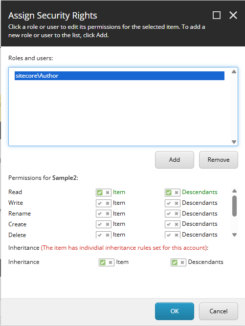

# Item Security

This page covers how to manage item-level security using SPE, including access control lists (ACLs), item locking, and protection.

## Overview

Sitecore's security model controls who can access items through Access Control Lists (ACLs). SPE provides cmdlets to programmatically manage these security settings, enabling bulk security operations and automated security configuration.

## Security Concepts

The Sitecore API utilizes a combination of parameters to represent an `AccessRule`. The following tables outline possible values for each parameter.

### Access Rights

Common access rights you can grant or deny:

| Access Right | Description                           |
| ------------ | ------------------------------------- |
| item:read    | Read item content and properties      |
| item:write   | Modify item fields                    |
| item:rename  | Rename items                          |
| item:create  | Create child items                    |
| item:delete  | Delete items                          |
| item:admin   | Administer item security              |
| field:read   | Read specific fields                  |
| field:write  | Write specific fields                 |
| \*           | Rights may be inherited by decendants |

### Propagation Types

Control how access rules propagate through the content tree:

| Propagation Type | Description                                      |
| ---------------- | ------------------------------------------------ |
| Any              | Applies to item and descendants                  |
| Descendants      | Applies only to descendants, not the item itself |
| Entity           | Applies only to this specific item               |

### Security Permissions

| Permission Type  | Description                                     |
| ---------------- | ----------------------------------------------- |
| AllowAccess      | Allow access to item/descendants                |
| DenyAccess       | Deny access to item/descendants                 |
| AllowInheritance | Allow inheritance of access to item/descendants |
| DenyInheritance  | Deny inheritance of access to item/descendants  |

### Raw Serialized Security Field

| Text | Description             |
| ---- | ----------------------- |
| ar   | Role account type       |
| au   | User account type       |
| pd   | Propagate descendants   |
| pe   | Propagate entity (item) |
| p\*  | Propagate any           |
| ^    | Allow inheritance       |
| !    | Deny inheritance        |
| +    | Allow access            |
| -    | Deny access             |

**Example:** The `sitecore\Author` role allowed access to read the item.

```
ar|sitecore\Author|pe|+item:read|
```

**Example:** The `sitecore\Author` role denied access to read the item descendants.

```
ar|sitecore\Author|pd|-item:read|
```

**Example:** Security rights for the parent item are not passed to the child items. Inheritance to descendants are denied for the `sitecore\Author` role.

```
ar|sitecore\Author|pd|^*|
```

**Example:** The `sitecore\Developer` role is allowed access to read the item and descendants.

```
ar|sitecore\Developer|pd|+item:read|pe|+item:read|
```

## Security Commands

Use `Get-Command` to discover all security-related commands:

```powershell
Get-Command -Noun Role*,User,ItemAcl* | Select-Object -Property Name | Sort-Object -Property Name
```

## Access Control Lists (ACLs)

ACLs define which users and roles have what permissions on items. SPE provides commands to create, read, and modify ACLs programmatically.

### Reading Item Security

**Example:** View current security settings on an item.

```powershell
Get-Item -Path "master:\content\home" | Select-Object -Property PSSecurity
```

**Output:**

```powershell
Name ID                                     __Owner        __Security
---- --                                     -------        ----------
Home {110D559F-DEA5-42EA-9C1C-8A5DF7E70EF9} sitecore\Admin ar|sitecore\Developer|pd|+item:read|pe|+item:read|
```

**Example:** Get detailed ACL information.

```powershell
$item = Get-Item -Path "master:\content\home"
Get-ItemAcl -Item $item
```

**Output:**

```powershell
Account            AccessRight PermissionType PropagationType SecurityPermission
-------            ----------- -------------- --------------- ------------------
sitecore\Developer item:read   Access         Descendants     AllowAccess
sitecore\Developer item:read   Access         Entity          AllowAccess
```

### Creating Access Rules

Use `New-ItemAcl` to create new access rules that can be applied to items.

**Example:** Create an ACL granting read access to Developers.

```powershell
$devRead = @{
    "Identity" = "sitecore\Developer"
    "PropagationType" = "Any"
    "SecurityPermission" = "AllowInheritance"
    "AccessRight" = "item:read"
}

$acl = New-ItemAcl @devRead
```

**Example:** Create an ACL denying inheritance.

```powershell
$everyoneDeny = @{
    "Identity" = "\Everyone"
    "PropagationType" = "Any"
    "SecurityPermission" = "DenyInheritance"
    "AccessRight" = "*"
}

$acl = New-ItemAcl @everyoneDeny
```

### Applying Access Rules

Use `Add-ItemAcl` to apply access rules to items.

**Example:** Apply an ACL to an item.

```powershell
$aclForEveryone = @{
    "Identity" = "\Everyone"
    "PropagationType" = "Any"
    "SecurityPermission" = "DenyInheritance"
    "AccessRight" = "*"
}

$acl = New-ItemAcl @aclForEveryone

Get-Item -Path "master:\content\home" |
    Add-ItemAcl -AccessRules $acl -PassThru
```

**Example:** Grant role-specific access.

```powershell
$authorAclRead = @{
    "Identity" = "sitecore\Author"
    "PropagationType" = "Any"
    "SecurityPermission" = "AllowAccess"
    "AccessRight" = "item:read"
}
$authorAclInherit = @{
    "Identity" = "sitecore\Author"
    "PropagationType" = "Any"
    "SecurityPermission" = "AllowInheritance"
    "AccessRight" = "*"
}

$acl1 = New-ItemAcl @authorAclRead
$acl2 = New-ItemAcl @authorAclInherit

Get-Item -Path "master:\content\home\sample2" |
    Add-ItemAcl -AccessRules $acl1,$acl2 -PassThru

Get-ItemAcl -Path "master:\content\home\sample2" | Format-Table
```

**Output:**

```powershell
Name                             Children Language Version Id                                     TemplateName
----                             -------- -------- ------- --                                     ------------
Sample2                          True     en       1       {91E814D3-78C8-44FA-B78B-E0A1B2374D8F} Sample Item


Account                          AccessRight          PermissionType   PropagationType  SecurityPermission
-------                          -----------          --------------   ---------------  ------------------
sitecore\Author                  item:read            Access           Descendants      AllowAccess
sitecore\Author                  *                    Inheritance      Descendants      AllowInheritance
sitecore\Author                  item:read            Access           Entity           AllowAccess
sitecore\Author                  *                    Inheritance      Entity           AllowInheritance
```



### Modifying Access Rules

Use `Set-ItemAcl` to replace existing access rules.

**Example:** Replace all access rules on an item.

```powershell
$authorAccessRights = @(
    "item:read",
    "item:write",
    "item:delete"
)

$authorAcl = @{
    "Identity" = "sitecore\Author"
    "PropagationType" = "Any"
    "SecurityPermission" = "AllowAccess"
}

$accessRules = @()
foreach($accessRight in $authorAccessRights) {
    $accessRules += @(New-ItemAcl @authorAcl -AccessRight $accessRight)
}

Set-ItemAcl -Item (Get-Item "master:\content\home") -AccessRules $accessRules -PassThru
```

### Removing Access Rules

Use `Clear-ItemAcl` to remove access rules from items.

**Example:** Clear all custom access rules.

```powershell
Get-Item -Path "master:\content\home" | Clear-ItemAcl
```

### Testing Access Rights

Use `Test-ItemAcl` to check if a user has specific rights on an item.

**Example:** Test if a role can read an item.

```powershell
$item = Get-Item -Path "master:\content\home"
$user = Get-Role -Identity "sitecore\Author"
Test-ItemAcl -Item $item -User $user -AccessRight "item:read"
```

## Bulk Security Operations

### Pattern: Apply Security to Content Item

```powershell
$authorAccessRights = @(
    "item:read",
    "item:write",
    "item:rename",
    "item:create",
    "item:delete"
)

$authorAcl = @{
    "Identity" = "sitecore\Author"
    "PropagationType" = "Descendants"
    "SecurityPermission" = "AllowAccess"
}

$accessRules = @()
foreach($accessRight in $authorAccessRights) {
    $accessRules += @(New-ItemAcl @authorAcl -AccessRight $accessRight)
}

Get-Item -Path "master:\content\home\sample2" |
    Add-ItemAcl -AccessRules $accessRules -PassThru
```

### Pattern: Apply Security to Content Tree

```powershell
$authorAccessRights = @(
    "item:read",
    "item:write",
    "item:rename",
    "item:create",
    "item:delete"
)

$authorAcl = @{
    "Identity" = "sitecore\Author"
    "PropagationType" = "Entity"
    "SecurityPermission" = "AllowAccess"
}

$accessRules = @()
foreach($accessRight in $authorAccessRights) {
    $accessRules += @(New-ItemAcl @authorAcl -AccessRight $accessRight)
}


$items = Get-ChildItem -Path "master:\content\home" -Recurse

foreach($item in $items) {
    Add-ItemAcl -Item $item -AccessRules $accessRules
    Write-Host "Applied security to: $($item.ItemPath)"
}
```

### Pattern: Security Audit Report

```powershell
$items = Get-ChildItem -Path "master:\content\home" -Recurse
$report = @()

foreach($item in $items) {
    $acls = Get-ItemAcl -Item $item

    foreach($acl in $acls) {
        $report += [PSCustomObject]@{
            ItemPath = $item.ItemPath
            Identity = $acl.Account.Name
            AccessRights = $acl.AccessRight -join ", "
            PropagationType = $acl.PropagationType
            SecurityPermission = $acl.SecurityPermission
        }
    }
}

$report | Show-ListView -Property ItemPath, Identity, AccessRights, PropagationType
```

### Pattern: Clone Security Settings

```powershell
# Copy security from one item to another
$sourceItem = Get-Item -Path "master:\content\home"
$targetItem = Get-Item -Path "master:\content\home\sample1"

# A combinination of Clear, Add, and Set may be used to alter item security
Write-Host "Cleared security for: $($sourceItem.ItemPath)"
Clear-ItemAcl -Item $targetItem

$sourceAcls = Get-ItemAcl -Item $sourceItem
if($sourceAcls) {
    # Use Set-ItemAcl if you wish to replace the rules
    Add-ItemAcl -Item $targetItem -AccessRules $sourceAcls
    Write-Host "Cloned security to: $($targetItem.ItemPath)"
} else {
    Write-Host "Cloned security to: $($targetItem.ItemPath)"
}
```

## Item Locking

Prevent other users from editing items by locking them.

### Locking Items

**Example:** Lock an item for editing.

```powershell
$item = Get-Item -Path "master:\content\home"
Lock-Item -Item $item
```

**Example:** Lock items in bulk.

```powershell
Get-ChildItem -Path "master:\content\protected" -Recurse |
    ForEach-Object {
        Lock-Item -Item $_
        Write-Host "Locked: $($_.ItemPath)"
    }
```

### Unlocking Items

**Example:** Unlock an item.

```powershell
$item = Get-Item -Path "master:\content\home"
Unlock-Item -Item $item
```

**Example:** Unlock all items in a tree.

```powershell
Get-ChildItem -Path "master:\content\protected" -Recurse |
    Where-Object { $_.Locking.IsLocked() } |
    ForEach-Object {
        Unlock-Item -Item $_
        Write-Host "Unlocked: $($_.ItemPath)"
    }
```

### Checking Lock Status

**Example:** Check if an item is locked.

```powershell
$item = Get-Item -Path "master:\content\home"
if ($item.Locking.IsLocked()) {
    Write-Host "Item is locked by: $($item.Locking.GetOwner())"
} else {
    Write-Host "Item is not locked"
}
```

## Item Protection

Protect items from accidental deletion or modification.

### Protecting Items

**Example:** Protect an item from deletion.

```powershell
$item = Get-Item -Path "master:\content\protected"
Protect-Item -Item $item
```

**Example:** Protect critical content.

```powershell
$criticalItems = Get-ChildItem -Path "master:\content\critical" -Recurse

foreach($item in $criticalItems) {
    Protect-Item -Item $item
    Write-Host "Protected: $($item.ItemPath)"
}
```

### Unprotecting Items

**Example:** Remove item protection.

```powershell
$item = Get-Item -Path "master:\content\home"
Unprotect-Item -Item $item
```

**Example:** Unprotect items in bulk.

```powershell
Get-ChildItem -Path "master:\content\temp" -Recurse |
    ForEach-Object {
        Unprotect-Item -Item $_
    }
```

## Security Best Practices

1. **Use roles over individual users** - Assign permissions to roles, then add users to roles
2. **Apply security at parent level** - Use propagation to apply security to entire trees
3. **Document security decisions** - Keep records of why security was applied
4. **Regular security audits** - Periodically review who has access to what
5. **Test before production** - Always test security changes in development first
6. **Use SecurityDisabler cautiously** - Only in controlled, administrative scripts
7. **Principle of least privilege** - Grant minimum permissions necessary

## See Also

- [Security - Users and Roles](../security/users-and-roles.md) - Managing users and roles
- [Editing Items](editing-items.md) - Update item properties
- [Best Practices](best-practices.md) - Performance and security patterns
- [Appendix - Security Commands](../appendix/security/README.md) - Full security cmdlet reference

## References

- [Sitecore Security Guide](https://doc.sitecore.com/xp/en/developers/latest/platform-administration-and-architecture/security.html)
- [Principle of Least Privilege](https://en.wikipedia.org/wiki/Principle_of_least_privilege)
